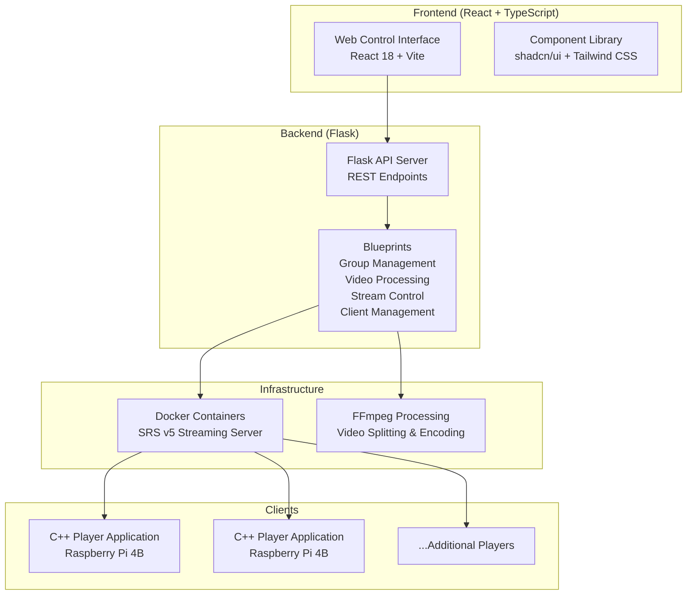

# Multi-Screen SRT Streaming System

A comprehensive real-time video streaming solution designed for multi-display installations using SRT (Secure Reliable Transport) protocol. This system, developed as part of the OpenVideoWalls project, supports synchronized playback across multiple screens with flexible layout configurations including horizontal, vertical, and grid arrangements.

##  Project Overview

This is a full-stack application for managing video wall systems with recycled heterogeneous displays. The system enables real-time streaming to multiple screens simultaneously with precise synchronization, supporting various layout configurations and streaming modes.

### Architecture Diagram



##  Key Features

### Display Management
- **Multi-Screen Support**: Control 2-16+ screens in various configurations
- **Flexible Layouts**: 
  - Horizontal (side-by-side)
  - Vertical (top-bottom)
  - Grid (2x2, 3x3, custom configurations)
- **Group Organization**: Create and manage multiple screen groups independently
- **Dynamic Port Assignment**: Automatic port allocation for each group

### Streaming Modes
- **Multi-Video Mode**: Each screen displays different video content
- **Single Video Split Mode**: One video automatically divided across all screens
- **Real-Time Synchronization**: Low-latency SRT protocol with SEI timestamp embedding
- **Persistent Stream IDs**: Consistent stream identification across sessions

### Client Management
- **Auto-Registration**: Clients automatically register with the server
- **Smart Assignment**: Automatic or manual assignment to groups and screens
- **Status Monitoring**: Real-time client status and health checking
- **Screen-Specific Assignment**: Direct client-to-screen mapping

### Video Processing
- **Format Support**: MP4, AVI, MOV, MKV, WebM
- **Automatic Resizing**: Optional 2K resolution processing
- **Upload Management**: Web-based video file upload and management
- **FFmpeg Integration**: Professional-grade video processing pipeline

##  Project Structure

```
multi-screen/
 frontend/                    # React web interface
    src/
       components/         # React components
          ui/            # UI component library
             GroupCard/ # Group management components
             CreateGroupDialog.tsx
             ...shadcn components
          NetworkConfiguration.tsx
          ScreenLayout.tsx
          SystemControls.tsx
          StatusDisplay.tsx
       hooks/             # Custom React hooks
          useScreenManagement.tsx
          useStreamSettings.tsx
          useSystemCommands.tsx
       types/             # TypeScript definitions
       App.tsx            # Main application component
       main.tsx           # Application entry point
    package.json           # Frontend dependencies
    vite.config.ts         # Vite configuration

 backend/
    endpoints/             # Flask backend server
        flask_app.py       # Main Flask application
        app_config.py      # Unified configuration system
        models/
           app_state.py   # Application state model
        utils/
           video_utils.py    # Video processing utilities
           ffmpeg_utils.py   # FFmpeg command builders
        blueprints/
           group_management.py   # Group CRUD operations
           video_management.py   # Video upload/processing
           stream_management.py  # SRT stream control
           client_management.py  # Client registration
           docker_management.py  # Container orchestration
        raw_video_file/    # Original video uploads
        resized_video/     # Processed video storage

 player/                     # C++ client player application
    main.cpp               # Player entry point
    CMakeLists.txt         # Build configuration

 external/                   # Third-party dependencies
 cmake-build-debug/          # Build output directory
 CMakeLists.txt             # Root build configuration
 documentation/
     Open_video_wall_midterm_final.pdf  # Academic report
```

##  Quick Start Guide

### Prerequisites

#### Server Requirements
- Ubuntu 22.04+ or similar Linux distribution
- Docker and Docker Compose
- Python 3.8+
- Node.js 16+ and npm
- FFmpeg with H.264 support
- Git

#### Client Requirements
- Raspberry Pi 4B with 4GB+ RAM
- Raspberry Pi OS (64-bit recommended)
- CMake 3.25+
- Build tools (gcc, g++, make, ninja-build)

#### Network Requirements
- All devices on same subnet
- Firewall access to ports:
  - 5000 (Flask API)
  - 5173 (Vite dev server)
  - 1935, 1985, 8080, 10080+ (SRT streaming per group)

### Installation

#### 1. Clone Repository
```bash
git clone https://github.com/hwsel/multi-screen.git
cd multi-screen
```

#### 2. Backend Setup
```bash
cd backend/endpoints

# Install Python dependencies
pip install flask flask-cors psutil

# Create video directories
mkdir -p raw_video_file resized_video

# Start Flask server
python flask_app.py
```

The backend will start on `http://localhost:5000`

#### 3. Frontend Setup
```bash
cd frontend

# Install dependencies
npm install

# Start development server
npm run dev
```

The frontend will be available at `http://localhost:5173`

#### 4. Build Player Application (on clients)
```bash
cd player
mkdir build && cd build
cmake ..
make -j4

# The player binary will be at: ./player
```

### Docker Setup for SRT Server

The system uses Docker containers for SRT streaming. Each group gets its own container:

```bash
# Pull the SRS image
docker pull ossrs/srs:5

# Containers are managed automatically via the web interface
# Or manually via API:
curl -X POST http://localhost:5000/create_group \
  -H "Content-Type: application/json" \
  -d '{
    "name": "Main Display",
    "screen_count": 4,
    "orientation": "horizontal",
    "streaming_mode": "multi_video"
  }'
```

##  Usage Guide

### Creating a Screen Group

1. **Access Web Interface**: Navigate to `http://localhost:5173`

2. **Create New Group**: Click "Create New Group" button

3. **Configure Group Settings**:
   - **Name**: Descriptive name for the group
   - **Screen Count**: Number of displays (2-16)
   - **Orientation**: 
     - Horizontal (side-by-side)
     - Vertical (stacked)
     - Grid (custom rows/columns)
   - **Streaming Mode**:
     - Multi-Video: Different content per screen
     - Single Video Split: One video divided across screens

4. **Start Docker Container**: Click "Start Docker" for the group

### Uploading Videos

1. **Navigate to Videos Section**: Click on "Videos" tab

2. **Upload Video Files**:
   ```bash
   # Via web interface: Use the upload button
   
   # Via API:
   curl -X POST http://localhost:5000/upload_video \
     -F "video=@your_video.mp4"
   ```

3. **Optional Processing**: Enable 2K resolution conversion if needed

### Configuring Streams

#### Multi-Video Mode
1. Select group in web interface
2. Click "Configure Videos"
3. Assign a different video to each screen
4. Click "Start Streaming"

#### Single Video Split Mode
1. Select group in web interface
2. Choose single video file
3. System automatically splits based on layout
4. Click "Start Split Video"

### Client Setup

On each Raspberry Pi client:

1. **Register Client**:
   ```bash
   curl -X POST http://server:5000/register_client \
     -H "Content-Type: application/json" \
     -d '{
       "hostname": "rpi-screen-1",
       "display_name": "Living Room Left"
     }'
   ```

2. **Assign to Group**: Use web interface to assign client to group and screen

3. **Start Player**:
   ```bash
   # Client will receive stream URL from server
   ./player 'srt://server:10080?streamid=#!::r=live/group_name/stream_id,m=request'
   ```

##  API Reference

### Group Management

#### Create Group
```http
POST /create_group
Content-Type: application/json

{
  "name": "Display Wall 1",
  "screen_count": 4,
  "orientation": "horizontal",
  "streaming_mode": "multi_video",
  "grid_rows": 2,  // For grid layout
  "grid_cols": 2   // For grid layout
}
```

#### List Groups
```http
GET /get_groups
```

#### Delete Group
```http
POST /delete_group
Content-Type: application/json

{
  "group_id": "group_uuid"
}
```

### Stream Management

#### Start Multi-Video Stream
```http
POST /start_multi_video_srt
Content-Type: application/json

{
  "group_id": "group_uuid",
  "video_files": [
    {"screen": 0, "file": "video1.mp4"},
    {"screen": 1, "file": "video2.mp4"},
    {"screen": 2, "file": "video3.mp4"},
    {"screen": 3, "file": "video4.mp4"}
  ]
}
```

#### Start Single Video Split
```http
POST /start_single_video_split
Content-Type: application/json

{
  "group_id": "group_uuid",
  "video_file": "main_video.mp4"
}
```

#### Stop Streaming
```http
POST /stop_group_srt
Content-Type: application/json

{
  "group_id": "group_uuid"
}
```

### Client Management

#### Register Client
```http
POST /register_client
Content-Type: application/json

{
  "hostname": "rpi-client-1",
  "display_name": "Conference Room Screen 1",
  "platform": "raspberry_pi"
}
```

#### Assign Client to Group
```http
POST /assign_client_to_group
Content-Type: application/json

{
  "client_id": "client_uuid",
  "group_id": "group_uuid"
}
```

#### Get Client Stream URL
```http
POST /client_status
Content-Type: application/json

{
  "client_id": "client_uuid"
}
```

### Video Management

#### Upload Video
```http
POST /upload_video
Content-Type: multipart/form-data

video: [binary video file]
```

#### List Videos
```http
GET /list_videos
```

#### Delete Video
```http
POST /delete_video
Content-Type: application/json

{
  "filename": "video_to_delete.mp4"
}
```

##  Troubleshooting

### Common Issues

#### Docker Container Won't Start
```bash
# Check if ports are in use
netstat -tulpn | grep -E "1935|1985|8080|10080"

# Check Docker logs
docker logs multiscreen_group_[id]

# Restart Docker service
sudo systemctl restart docker
```

#### FFmpeg Process Fails
```bash
# Verify FFmpeg installation
ffmpeg -version

# Check FFmpeg supports H.264
ffmpeg -codecs | grep h264

# Test manual stream
ffmpeg -re -i test.mp4 -c:v libx264 -f mpegts "srt://localhost:10080?streamid=#!::r=live/test,m=publish"
```

#### Client Can't Connect
```bash
# Test network connectivity
ping server_ip

# Test SRT port
telnet server_ip 10080

# Check firewall rules
sudo ufw status
```

#### Web Interface Issues
```bash
# Check backend is running
curl http://localhost:5000/

# Verify frontend build
cd frontend && npm run build

# Check browser console for errors (F12)
```

### Debug Mode

Enable detailed logging:

```python
# In backend/endpoints/flask_app.py
import logging
logging.basicConfig(level=logging.DEBUG)
```

```bash
# Run with debug output
LOG_LEVEL=DEBUG python flask_app.py
```

### Performance Optimization

#### Raspberry Pi Optimization
```bash
# Increase GPU memory split
sudo raspi-config
# Advanced Options -> Memory Split -> 256

# Enable hardware acceleration in /boot/config.txt
gpu_mem=256
start_x=1
```

#### Network Optimization
```bash
# Increase UDP buffer sizes
echo 'net.core.rmem_max = 134217728' | sudo tee -a /etc/sysctl.conf
echo 'net.core.wmem_max = 134217728' | sudo tee -a /etc/sysctl.conf
sudo sysctl -p
```

##  Technical Details

### SRT Protocol Configuration
- **Latency**: 5000ms default (configurable)
- **Packet Size**: 1316 bytes
- **Encryption**: Optional AES-128/256
- **Mode**: Live streaming with timestamp embedding

### Video Processing Pipeline
1. **Input**: Original video file (any format)
2. **Optional Resize**: Scale to 2K resolution
3. **Segmentation**: Split based on screen layout
4. **Encoding**: H.264 with SEI metadata
5. **Streaming**: SRT protocol with unique stream IDs

### State Management
- **Backend**: In-memory state with optional persistence
- **Frontend**: React hooks with localStorage for settings
- **Synchronization**: REST API with polling for updates

##  Contributing

1. Fork the repository
2. Create feature branch: `git checkout -b feature/new-feature`
3. Commit changes: `git commit -am 'Add new feature'`
4. Push to branch: `git push origin feature/new-feature`
5. Submit pull request

### Development Guidelines
- Follow TypeScript best practices for frontend
- Use Flask blueprints for backend modularity
- Write unit tests for new features
- Update documentation for API changes

##  License

This project is part of the OpenVideoWalls research initiative. See LICENSE file for details.

##  Acknowledgments

- **OpenVideoWalls Project**: For the video wall synchronization research
- **SRS (Simple Realtime Server)**: For reliable SRT streaming infrastructure
- **FFmpeg**: For powerful video processing capabilities
- **shadcn/ui**: For the modern React component library
- **Flask**: For the flexible Python web framework

##  Support

- **Issues**: [GitHub Issues](https://github.com/hwsel/multi-screen/issues)
- **Documentation**: See `/documentation` folder
- **Academic Paper**: Open_video_wall_midterm_final.pdf

---

**Note**: This system is designed for professional AV installations, digital signage, and multi-display applications requiring synchronized, low-latency video playback across multiple screens.