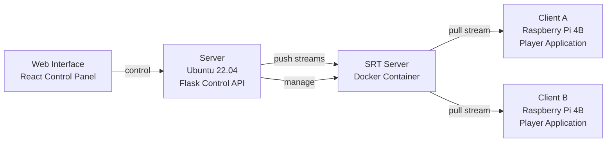

# Multi-Screen SRT Streaming System

A comprehensive real-time video streaming solution designed for multi-display installations using SRT (Secure Reliable Transport) protocol. The system supports synchronized playback across multiple screens with flexible layout configurations including horizontal, vertical, and grid arrangements.asd

## 🎯 Project Overview



This system enables:
- **Real-time video streaming** to multiple displays simultaneously
- **Flexible screen layouts** (horizontal, vertical, grid arrangements)
- **Group management** for organizing multiple screen setups
- **Remote control** via web interface
- **Video file processing** and test pattern generation
- **Client registration** and automatic stream assignment

## ✨ Features

- 🖥️ **Multi-Screen Support**: Control 2-16+ screens in various layouts
- 🌐 **Web-Based Control Panel**: React interface for remote management
- 🎬 **Video Processing**: Upload and stream custom video content
- 🔄 **Real-Time Synchronization**: Low-latency SRT streaming
- 📐 **Grid Layouts**: Support for 2x2, 3x3, and custom grid configurations
- 🐳 **Containerized**: Docker-based SRT server deployment
- 🎯 **Group Management**: Organize multiple screen installations
- 📱 **Client Auto-Discovery**: Automatic client registration and assignment

## 🏗️ Architecture

### Core Components

1. **Flask Control Server** (`/srt_control_server/`)
   - RESTful API for system control
   - Group and client management
   - FFmpeg process orchestration
   - Video file handling

2. **SRT Streaming Server** (Docker)
   - Containerized SRS (Simple Realtime Server)
   - Multi-stream support with dynamic ports
   - Low-latency video distribution

3. **Client Players** (`/player/`)
   - C++ application using FFmpeg libraries
   - Optimized for Raspberry Pi hardware
   - Hardware-accelerated video decoding

4. **Web Control Interface** (`/web/`)
   - React-based control panel
   - Real-time status monitoring
   - Layout configuration tools

## 🚀 Quick Start

### Prerequisites

- **Server**: Ubuntu 22.04+ with Docker
- **Clients**: Raspberry Pi 4B with Raspberry Pi OS (64-bit)
- **Development**: CMake 3.25+, build-essential, ninja-build
- **Network**: All devices on same subnet with firewall access to ports 1935, 1985, 8080, 10080

### 1. Clone the Repository

Clone on the server and all client devices:

```bash
git clone https://github.com/hwsel/multi-screen.git
cd multi-screen
```

### 2. Setup Development Environment

Configure CMake build environment on all machines:

```bash
cmake \
  -DEP_BUILD_ALWAYS=1L \
  -DEP_J=<max_jobs> \
  -DCMAKE_BUILD_TYPE=Debug \
  -DCMAKE_MAKE_PROGRAM=/usr/bin/ninja \
  -G Ninja \
  -S . \
  -B ./cmake-build-debug
```

**Parameters:**
- `<max_jobs>`: CPU cores (use 36 for server, 3 for Raspberry Pi)
- Automatically compiles server-side components and FFmpeg

**Examples:**
- **Server**: `cmake -DEP_BUILD_ALWAYS=1L -DEP_J=36 -DCMAKE_BUILD_TYPE=Debug -DCMAKE_MAKE_PROGRAM=/usr/bin/ninja -G Ninja -S . -B ./cmake-build-debug`
- **Client**: `cmake -DEP_BUILD_ALWAYS=1L -DEP_J=3 -DCMAKE_BUILD_TYPE=Debug -DCMAKE_MAKE_PROGRAM=/usr/bin/ninja -G Ninja -S . -B ./cmake-build-debug`

### 3. Compile Client Player

On all Raspberry Pi clients:

```bash
cmake \
  --build ./cmake-build-debug \
  --clean-first \
  --target player \
  -j 3
```

### 4. Start SRT Server

Install Docker and launch the SRT streaming server:

```bash
# Install Docker (Ubuntu)
curl -fsSL https://get.docker.com -o get-docker.sh
sudo sh get-docker.sh

# Start SRT Server Container
sudo docker run \
  --rm \
  -it \
  -p 1935:1935 \
  -p 1985:1985 \
  -p 8080:8080 \
  -p 10080:10080/udp \
  ossrs/srs:5 \
  ./objs/srs -c conf/srt.conf
```

**Note:** Replace `<SRT_IP>` in subsequent commands with the IP address of this machine.

### 5. Configure Server Streaming

Start video streaming with test pattern or custom video:

#### Test Pattern (Default)
```bash
SEI=681d5c8f-80cd-4847-930a-99b9484b4a32+000000 \
./cmake-build-debug/external/Install/bin/ffmpeg \
  -y \
  -re \
  -f lavfi -i testsrc=s=3840x1080:r=30 \
  -filter_complex "\
    color=c=black:s=3840x1080[main];\
    [main][0:v]overlay=x=0:y=0[main];\
    [main]split=3[mon][mon1][mon2];\
    [mon1]crop=w=1920:h=1080:x=0:y=0[mon1];\
    [mon2]crop=w=1920:h=1080:x=1920:y=0[mon2]" \
  -map "[mon]" \
  -an -c:v libx264 \
  -bsf:v h264_metadata=sei_user_data=$SEI \
  -pes_payload_size 0 -bf 0 -g 1 \
  -f mpegts "srt://<SRT_IP>:10080?streamid=#!::r=live/test,m=publish" \
  -map "[mon1]" \
  -an -c:v libx264 \
  -bsf:v h264_metadata=sei_user_data=$SEI \
  -pes_payload_size 0 -bf 0 -g 1 \
  -f mpegts "srt://<SRT_IP>:10080?streamid=#!::r=live/test1,m=publish" \
  -map "[mon2]" \
  -an -c:v libx264 \
  -bsf:v h264_metadata=sei_user_data=$SEI \
  -pes_payload_size 0 -bf 0 -g 1 \
  -f mpegts "srt://<SRT_IP>:10080?streamid=#!::r=live/test2,m=publish"
```

This creates:
- A 3840x1080 combined stream (`test`)
- Left half stream 1920x1080 (`test1`)
- Right half stream 1920x1080 (`test2`)

### 6. Launch Client Players

On each Raspberry Pi client:

#### For Screen 1 (Left Half)
```bash
./cmake-build-debug/player/player 'srt://<SRT_IP>:10080?streamid=#!::r=live/test1,m=publish'
```

#### For Screen 2 (Right Half)
```bash
./cmake-build-debug/player/player 'srt://<SRT_IP>:10080?streamid=#!::r=live/test2,m=publish'
```

#### Alternative: Using FFplay for Testing
```bash
# Basic playback
./cmake-build-debug/external/Install/bin/ffplay 'srt://<SRT_IP>:10080?streamid=#!::r=live/test2,m=request,latency=5000000'

# With logging
./cmake-build-debug/external/Install/bin/ffplay 'srt://<SRT_IP>:10080?streamid=#!::r=live/test2,m=request,latency=5000000' 2>&1 | tee ffplay.log
```

## 🎛️ Advanced Configuration

### Flask Control Server

Start the web-based control server:

```bash
cd srt_control_server
pip install flask flask-cors psutil
python app.py
```

Access the control panel at `http://localhost:5000`

### API Endpoints

#### Screen Management
- `POST /set_screen_ips` - Configure screen count, IPs, and orientation
- `GET /screen_status` - Get current screen configuration
- `POST /launch_player` - Launch player on specific screen

#### Stream Management
- `POST /start_srt` - Start SRT stream using FFmpeg
- `POST /stop_srt` - Stop running FFmpeg process
- `POST /upload_video` - Upload and validate video file

#### Docker Management
- `POST /start_docker` - Start SRT Docker container
- `POST /stop_docker` - Stop SRT Docker container

#### Client Management
- `POST /register_client` - Register client device
- `POST /client_status` - Check client stream assignment
- `GET /get_clients` - List all registered clients
- `POST /assign_stream` - Assign stream to client

#### Group Management
- `POST /create_group` - Create new screen group
- `GET /groups` - List all groups
- `POST /assign_client_to_group` - Assign client to group

### Layout Configurations

#### Horizontal Layout (2-4 screens)
```json
{
  "orientation": "horizontal",
  "screen_count": 3,
  "screen_ips": {
    "1": "192.168.1.101",
    "2": "192.168.1.102", 
    "3": "192.168.1.103"
  }
}
```

#### Grid Layout (2x2, 3x3, etc.)
```json
{
  "orientation": "grid",
  "grid_rows": 2,
  "grid_cols": 3,
  "screen_count": 6,
  "screen_ips": {
    "1": "192.168.1.101",
    "2": "192.168.1.102",
    "3": "192.168.1.103",
    "4": "192.168.1.104",
    "5": "192.168.1.105",
    "6": "192.168.1.106"
  }
}
```

### Custom Video Processing

Upload custom videos via the web interface or API:

```bash
curl -X POST \
  -F "video=@your_video.mp4" \
  http://localhost:5000/upload_video
```

Supported formats: MP4, AVI, MOV, MKV

## 🔧 Project Structure

```
multi-screen/
├── cmake-build-debug/          # Build output directory
├── srt_control_server/         # Flask-based control server
│   ├── app.py                  # Main application entry
│   ├── config.py               # Configuration management
│   ├── models/                 # Data models
│   ├── utils/                  # Utility functions
│   ├── blueprints/             # API route modules
│   ├── static/                 # Static web assets
│   ├── templates/              # HTML templates
│   └── uploads/                # Video file storage
├── player/                     # C++ client player source
├── web/                        # React control interface
│   ├── src/
│   │   ├── components/         # React components
│   │   ├── hooks/              # Custom React hooks
│   │   └── types/              # TypeScript definitions
│   └── public/                 # Static assets
├── external/                   # Third-party dependencies
├── CMakeLists.txt              # Build configuration
└── README.md                   # This file
```

## 🐛 Troubleshooting

### Common Issues

**FFmpeg not found**
```bash
# Verify FFmpeg installation
./cmake-build-debug/external/Install/bin/ffmpeg -version
```

**Docker permission denied**
```bash
# Add user to docker group
sudo usermod -aG docker $USER
logout  # and log back in
```

**Client connection timeout**
- Check firewall settings (ports 1935, 1985, 8080, 10080)
- Verify SRT server is running: `docker ps`
- Test connectivity: `telnet <SRT_IP> 10080`

**Poor streaming quality**
- Reduce bitrate in FFmpeg command
- Check network bandwidth
- Adjust SRT latency parameter

### Debug Mode

Enable verbose logging:

```bash
# Server-side debugging
export LOG_LEVEL=DEBUG
python app.py

# Client-side debugging
./cmake-build-debug/player/player -v 'srt://...'
```

### Performance Optimization

**Raspberry Pi Clients:**
- Enable GPU memory split: `sudo raspi-config` → Advanced → Memory Split → 128
- Overclock safely: Add to `/boot/config.txt`:
  ```
  arm_freq=1750
  gpu_freq=600
  ```
- Use hardware acceleration: `--enable-decoder=h264_v4l2m2m`

**Server Optimization:**
- Use dedicated network interface
- Increase UDP buffer sizes:
  ```bash
  echo 'net.core.rmem_max = 134217728' >> /etc/sysctl.conf
  echo 'net.core.rmem_default = 134217728' >> /etc/sysctl.conf
  ```

## 🤝 Contributing

1. Fork the repository
2. Create feature branch: `git checkout -b feature/new-feature`
3. Commit changes: `git commit -am 'Add new feature'`
4. Push to branch: `git push origin feature/new-feature`
5. Submit pull request

## 📄 License

This project is licensed under the MIT License - see the [LICENSE](LICENSE) file for details.

## 🙋 Support

- **Issues**: [GitHub Issues](https://github.com/hwsel/multi-screen/issues)
- **Documentation**: [Wiki](https://github.com/hwsel/multi-screen/wiki)
- **Discussions**: [GitHub Discussions](https://github.com/hwsel/multi-screen/discussions)

## 🏷️ Version History

- **v2.0.0** - Group management, grid layouts, React interface
- **v1.5.0** - Flask control server, client registration
- **v1.0.0** - Basic SRT streaming, horizontal/vertical layouts
- **v0.9.0** - Initial CMake build system, FFmpeg integration

---

**Note:** This system is designed for professional AV installations, digital signage, and multi-display applications requiring synchronized, low-latency video playback across multiple screens.
# Mulitiscreen
