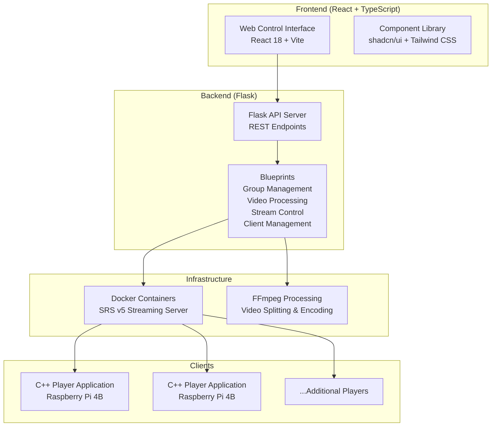

# Multi-Screen SRT Streaming System

A comprehensive real-time video streaming solution designed for multi-display installations using SRT (Secure Reliable Transport) protocol. This system supports synchronized playback across multiple screens with flexible layout configurations including horizontal, vertical, and grid arrangements.

## Project Overview

This is a full-stack application for managing video wall systems with recycled heterogeneous displays. The system enables real-time streaming to multiple screens simultaneously with precise synchronization, supporting various layout configurations and streaming modes.

### Key Features
- **Multi-Screen Support**: Control 2-16+ screens in various configurations
- **Flexible Layouts**: Horizontal, vertical, and grid arrangements
- **Real-Time Synchronization**: Low-latency SRT protocol with SEI timestamp embedding
- **Multiple Streaming Modes**: Multi-video and single video split modes
- **Client Management**: Automatic client registration and smart assignment
- **Professional Video Processing**: FFmpeg integration with format support

## System Architecture



## Project Structure

```
UB_Intern/
├── frontend/                    # React web interface
│   ├── src/
│   │   ├── components/         # React components
│   │   │   ├── ui/            # shadcn/ui component library
│   │   │   ├── StreamsTab/    # Streaming management
│   │   │   ├── ClientsTab.tsx # Client management
│   │   │   └── VideoFilesTab.tsx # Video management
│   │   ├── hooks/             # Custom React hooks
│   │   ├── types/             # TypeScript definitions
│   │   └── App.tsx            # Main application
│   ├── config/build/          # Build configuration
│   │   └── vite.config.ts     # Vite configuration
│   └── package.json           # Frontend dependencies
├── backend/                    # Flask backend server
│   └── endpoints/
│       ├── flask_app.py       # Main Flask application
│       ├── app_config.py      # Configuration management
│       ├── blueprints/        # Route handlers
│       │   ├── group_management.py   # Group operations
│       │   ├── video_management.py   # Video operations
│       │   ├── streaming/            # Stream control
│       │   ├── client_management.py  # Client operations
│       │   └── docker_management.py  # Container orchestration
│       ├── services/          # Business logic
│       │   ├── ffmpeg_service.py     # Video processing
│       │   ├── docker_service.py     # Container management
│       │   └── srt_service.py        # SRT operations
│       └── uploads/           # Video file storage
├── client/                     # C++ client player application
│   └── multi-screen/
│       └── player/            # Player source code
└── Errors.md                   # Error code documentation
```

## Quick Start Guide

### Prerequisites

#### Server Requirements
- **OS**: Ubuntu 22.04+ or similar Linux distribution
- **Python**: 3.8+
- **Node.js**: 16+ and npm
- **Docker**: Docker and Docker Compose
- **FFmpeg**: With H.264 support
- **Git**: For cloning the repository

#### Client Requirements
- **Hardware**: Raspberry Pi 4B with 4GB+ RAM
- **OS**: Raspberry Pi OS (64-bit recommended)
- **Build Tools**: CMake 3.25+, gcc, g++, make
- **Network**: Same subnet as server

#### Network Requirements
- All devices on same subnet
- Firewall access to ports:
  - 5000 (Flask API)
  - 5173 (Vite dev server)
  - 1935, 1985, 8080, 10080+ (SRT streaming per group)

### Installation Steps

#### 1. Clone Repository
```bash
git clone https://github.com/Sira-K/Multiscreen
cd Multiscreen
```

#### 2. Backend Setup
```bash
cd backend/endpoints

# Install Python dependencies
pip install flask flask-cors psutil

# Create video directories
mkdir -p uploads

# Start Flask server
python flask_app.py
```

The backend will start on `http://localhost:5000`

#### 3. Frontend Setup
```bash
cd frontend

# Install dependencies
npm install

# Start development server
npm run dev
```

The frontend will be available at `http://localhost:5173`

#### 4. Build Player Application (on clients)
```bash
cd client/multi-screen/player
mkdir build && cd build
cmake ..
make -j4

# The player binary will be at: ./player
```

### Docker Setup for SRT Server

The system uses Docker containers for SRT streaming. Each group gets its own container:

```bash
# Pull the SRS image
docker pull ossrs/srs:5

# Containers are managed automatically via the web interface
```

## Usage Guide

### 1. Creating a Screen Group

1. **Access Web Interface**: Navigate to `http://localhost:5173`
2. **Create New Group**: Click "Create New Group" button
3. **Configure Group Settings**:
   - **Name**: Descriptive name for the group
   - **Screen Count**: Number of displays (2-16)
   - **Orientation**: Horizontal, vertical, or grid
   - **Streaming Mode**: Multi-video or single video split
4. **Start Docker Container**: Click "Start Docker" for the group

### 2. Uploading Videos

1. **Navigate to Videos Section**: Click on "Videos" tab
2. **Upload Video Files**: Use the upload button or drag & drop
3. **Supported Formats**: MP4, AVI, MOV, MKV, WebM

### 3. Configuring Streams

#### Multi-Video Mode
1. Select group in web interface
2. Click "Configure Videos"
3. Assign a different video to each screen
4. Click "Start Streaming"

#### Single Video Split Mode
1. Select group in web interface
2. Choose single video file
3. System automatically splits based on layout
4. Click "Start Split Video"

### 4. Client Setup

On each Raspberry Pi client:

1. **Register Client**:
   ```bash
   curl -X POST http://server:5000/register_client \
     -H "Content-Type: application/json" \
     -d '{
       "hostname": "rpi-screen-1",
       "display_name": "Living Room Left"
     }'
   ```

2. **Assign to Group**: Use web interface to assign client to group and screen
3. **Start Player**: Client will receive stream URL from server

## API Reference

### Core Endpoints

#### Group Management
- `POST /create_group` - Create new screen group
- `GET /get_groups` - List all groups
- `POST /delete_group` - Remove group

#### Stream Management
- `POST /start_multi_video_srt` - Start multi-video streaming
- `POST /start_single_video_split` - Start split video streaming
- `POST /stop_group_srt` - Stop streaming

#### Client Management
- `POST /register_client` - Register new client
- `POST /assign_client_to_group` - Assign client to group
- `GET /client_status` - Get client status

#### Video Management
- `POST /upload_video` - Upload video file
- `GET /list_videos` - List available videos
- `POST /delete_video` - Remove video file

### Example API Usage

```bash
# Create a group
curl -X POST http://localhost:5000/create_group \
  -H "Content-Type: application/json" \
  -d '{
    "name": "Main Display",
    "screen_count": 4,
    "orientation": "horizontal",
    "streaming_mode": "multi_video"
  }'

# Start streaming
curl -X POST http://localhost:5000/start_multi_video_srt \
  -H "Content-Type: application/json" \
  -d '{
    "group_id": "group_uuid",
    "video_files": [
      {"screen": 0, "file": "video1.mp4"},
      {"screen": 1, "file": "video2.mp4"}
    ]
  }'
```

## Notable Systems

### 1. **Error Management System**
- Comprehensive error handling with error codes
- Error lookup interface (`frontend/error_lookup.html`)
- Centralized error documentation (`Errors.md`)

### 2. **Streaming Architecture**
- **Multi-Stream Mode**: Independent streams per screen
- **Split-Stream Mode**: Single video divided across screens
- **SRT Protocol**: Low-latency, reliable streaming
- **Docker Orchestration**: Automatic container management per group

### 3. **Client Management**
- Automatic client registration and discovery
- Smart assignment algorithms
- Real-time status monitoring
- Screen-specific mapping

### 4. **Video Processing Pipeline**
- Format validation and conversion
- Optional 2K resolution processing
- FFmpeg integration for professional-grade processing
- Automatic video splitting based on layout

### 5. **Frontend Architecture**
- **React 18** with TypeScript
- **shadcn/ui** component library
- **Tailwind CSS** for styling
- **Vite** for fast development and building
- Modular component structure with custom hooks

## Configuration

### Backend Configuration (`backend/endpoints/app_config.json`)
- Server settings (host, port, debug mode)
- File upload settings (max size, allowed extensions)
- Streaming parameters (framerate, bitrate, SRT settings)

### Frontend Configuration (`frontend/config/`)
- **Build**: Vite configuration
- **Styling**: Tailwind CSS configuration
- **TypeScript**: TypeScript compiler options
- **Linting**: ESLint configuration

## Troubleshooting

### Common Issues

#### Docker Container Won't Start
```bash
# Check if ports are in use
netstat -tulpn | grep -E "1935|1985|8080|10080"

# Check Docker logs
docker logs multiscreen_group_[id]
```

#### FFmpeg Process Fails
```bash
# Verify FFmpeg installation
ffmpeg -version

# Check H.264 support
ffmpeg -codecs | grep h264
```

#### Client Can't Connect
```bash
# Test network connectivity
ping server_ip

# Test SRT port
telnet server_ip 10080
```

### Debug Mode

Enable detailed logging:

```python
# In backend/endpoints/flask_app.py
import logging
logging.basicConfig(level=logging.DEBUG)
```

```bash
# Run with debug output
LOG_LEVEL=DEBUG python flask_app.py
```

## Development

### Project Structure Principles
- **Backend**: Service-oriented architecture with Flask blueprints
- **Frontend**: Component-based architecture with custom hooks
- **Separation of Concerns**: Clear boundaries between layers
- **Type Safety**: TypeScript for frontend, type hints for Python

### Building and Testing
```bash
# Frontend build
cd frontend
npm run build

# Frontend development
npm run dev

# Backend development
cd backend/endpoints
python flask_app.py
```

### Code Quality
- **Frontend**: ESLint + TypeScript strict mode
- **Backend**: PEP 8 compliance, type hints
- **Architecture**: Clean interfaces, single responsibility

## Documentation

- **Error Codes**: `Errors.md` - Comprehensive error documentation
- **API Reference**: See API section above
- **Architecture**: See system architecture diagram
- **Configuration**: See configuration section

## Contributing

1. Fork the repository
2. Create feature branch: `git checkout -b feature/new-feature`
3. Commit changes: `git commit -am 'Add new feature'`
4. Push to branch: `git push origin feature/new-feature`
5. Submit pull request

### Development Guidelines
- Follow TypeScript best practices for frontend
- Use Flask blueprints for backend modularity
- Write unit tests for new features
- Update documentation for API changes

## License

This project is part of the OpenVideoWalls research initiative. See LICENSE file for details.

## Acknowledgments

- **OpenVideoWalls Project**: For the video wall synchronization research
- **SRS (Simple Realtime Server)**: For reliable SRT streaming infrastructure
- **FFmpeg**: For powerful video processing capabilities
- **shadcn/ui**: For the modern React component library
- **Flask**: For the flexible Python web framework

## Support

- **Issues**: [GitHub Issues](https://github.com/your-repo/issues)
- **Documentation**: See documentation sections above
- **Academic Paper**: Openwall paper.pdf (included in repository)

---

**Note**: This system is designed for professional AV installations, digital signage, and multi-display applications requiring synchronized, low-latency video playback across multiple screens.
